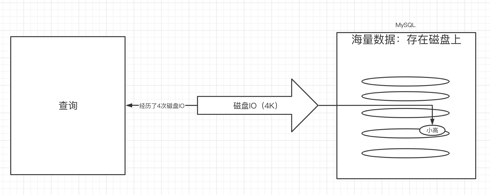

# 一、索引的概述

## 1.为什么要使用索引

在海量数据中查询一条记录，这样的场景经常发生，如果没有使用索引，那么查询的速度非常慢。通过创建索引，依赖于索引来进行的查询，速度是非常快的，那么带来以下几个问题？

- 索引是什么？
- 索引为什么快？
- 为什么不使用索引会这么慢？


## 2.索引是什么

如果没有使用索引，每次查数据要进行多次的磁盘io，每次io获得4k数据，如果4k数据中没有查到需要的数据继续进行下一次磁盘io，直到查到数据为止。——没有索引会很慢。



索引相当于是字典的目录。在查询时先查询目录，快速获得数据所在的磁盘地址，根据地址直接在磁盘上获得数据，不需要进行多次磁盘io——使用索引速度快。


## 3.为什么查询索引就很快？

索引中存了海量数据和地址的“映射关系”，那如何在索引中的海量数据中快速的查找到某一条数据呢？——搞清楚这个问题，才能算是搞清楚为什么时候索引快！

这就跟索引使用了哪种数据结构有关系。


## 4.索引的存放位置

索引是保存在磁盘中的。

在mac系统中，索引是保存在`mysql的安装路径/data/数据库名文件夹` 中，在windows平台：`c://programdata(隐藏文件)/mysql/data`

在文件夹中发现有两种格式的文件：

- .ibd(表是使用了innoDB引擎):  employees.ibd该文件中包含了数据和索引，（frm 用来保存表的结构）
- .MYI .MYD（表是使用了MyISAM引擎）: .MYI 文件保存的是索引，.MYD 保存的是数据


## 5.索引的分类及创建

- 主键索引

表的主键是自带索引的，所以建议大家建表的时候一定要创建主键

- 普通索引

给普通列创建的索引

```sql
# 格式
create index 索引名 on 表名(列名)
# 例子
create index idx_name on employess(name)
```

- 唯一索引

该索引列中的值是唯一的，性能比普通索引要好。

```sql
# 格式
create unique index 索引名 on 表名(列名)
# 例子
create unique index idx_name on employess(name)
```

- 组合索引(联合索引)

一次性为多个列创建索引，可以减少索引带来的磁盘空间的开销，但是使用组合索引需要有一些规则（最左前缀法则）

```sql
# 格式
create index 索引名 on 表名(列1,列2)
# 例子
create index idx_name_age on employees(name,age)
```

- 全文索引

实现全文检索的效果，目前的版本InnoDB和MyISAM存储引擎都支持全文索引，但是我们不会用mysql做全文检索，而是用第三方的搜索引擎中间件比如es/solr来做。

# 二、索引的数据结构

索引中也存了海量数据，那么为什么在索引的海量数据中查找数据就可以很快？ 这就跟索引使用了哪种数据结构有关系，接下来聊一下数据结构相关的知识。

## 1.线性表

- 顺序线性表（数组）：增删慢，查询快
- 链式线性表（链表）：增删快，查询慢
  - 单向链表
  - 双向链表
  - 循环链表

## 2.栈和队列

- 栈：先进后出
  - 顺序栈
  - 链式栈
- 队列：先进先出
  - 顺序队列
  - 链式队列

## 3.树

树的概念在数据结构中是非常重要的。

### 1）二叉树

一个节点最多有2个字节点

### 2）多叉树

可以有大于等于2个字节点

### 3）二叉排序树

二叉排序树及其中的任何一颗子树都需要满足以下规则，中间节点始终比其左子树中任何一个节点要大，始终比其右子树中的任何一个节点要小

### 4）平衡二叉树

平衡二叉树的特点：首先平衡二叉树是一颗二叉排序树。平衡二叉树及其所有的子树都应该满足：左子树的深度和右子树的深度差不能超过1。因为平衡二叉树的这个特点，所以查询的性能是非常好的。

二叉排序树可以通过多种方案的旋转来变成一颗平衡二叉树。

### 5）红黑树

一颗二叉排序树可以通过旋转，转换成平衡二叉树。那么红黑树的特色就是可以自己旋转，将自己（二叉排序树）转换成平衡二叉树，但是红黑树在某些情况下，自旋后并不是一颗平衡二叉树。为什么？因为红黑树在旋转和不旋转之间做了性能的权衡，有些时候，不旋转虽然不平衡，但是旋转带来的性能提升不明显，反而造成为了旋转而带来的开销。


### 6）B树

如果索引使用红黑树这种数据结构来存数据的话，那么数据量一大，红黑树的深度会变得非常的深，于是整个查询性能会变得非常慢。究其原因，因为每一层存储的数据的个数太少了。因此B树就出现了


### 7）B+树

B+树的特点：

1.非叶子节点冗余了叶子节点的键

2.叶子节点从小到大，从左到右排列

3.叶子之间提供了指针，提高了区间访问的性能

4.只有叶子节点存放数据，其他节点不存放数据，只存放键。

根据计算，只用三层的b+树，最多能查找2千多万个数据。

```
16kb/14b * 16kb/14b*15
```


# 作业

- 掌握es中的各种查询
- 编写搜索服务
- 实现多服务之间的通信（对外http，对内dubbo）
- 掌握索引的概念
- 掌握数据结构的基本概念

- 写简历